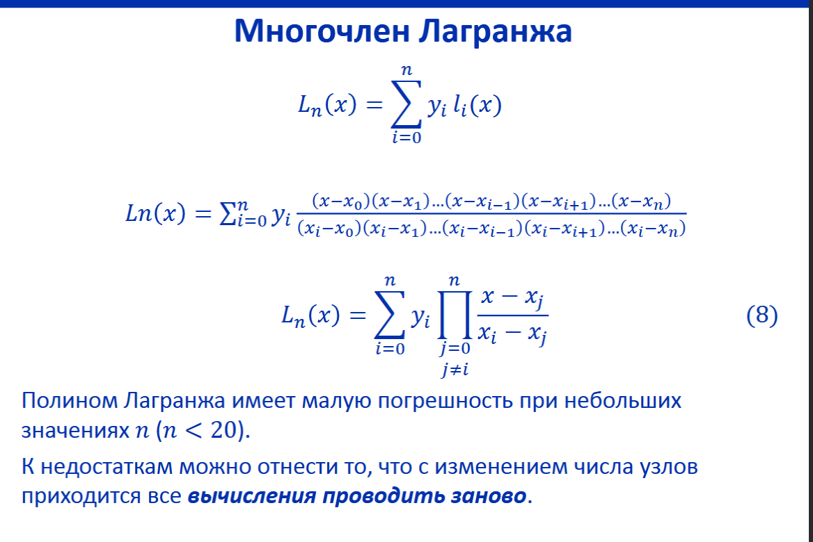
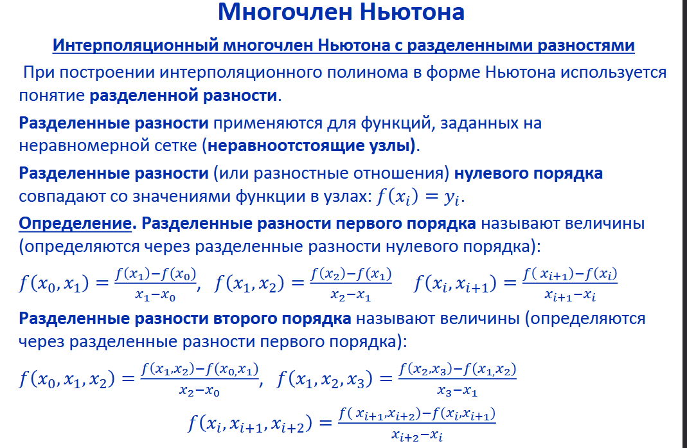
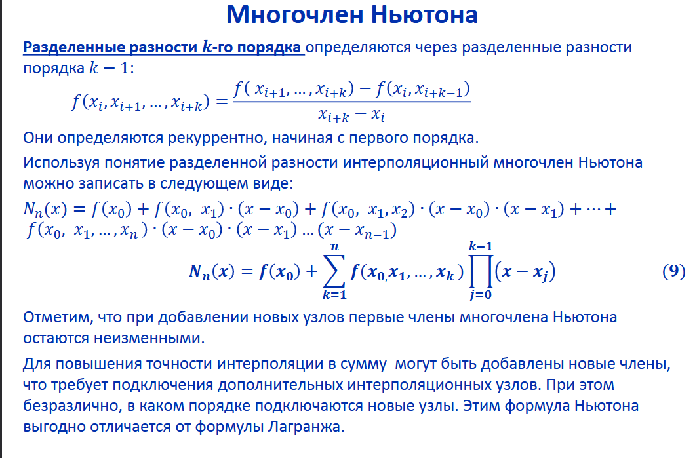

### Лабораторная работа №3
Цель: получить навыки работы с вводом/выводом, потоковой обработкой данных, командной строкой.
В рамках лабораторной работы вам предлагается повторно реализовать лабораторную работу по предмету "Вычислительная математика" посвящённую интерполяции (в разные годы это лабораторная работа 3 или 4) со следующими дополнениями:

обязательно должна быть реализована линейная интерполяция (отрезками, link);
настройки алгоритма интерполяции и выводимых данных должны задаваться через аргументы командной строки:

какие алгоритмы использовать (в том числе два сразу);
частота дискретизации результирующих данных;
и т.п.;

входные данные должны задаваться в текстовом формате на подобии ".csv" (к примеру x;y\n или x\ty\n) и подаваться на стандартный ввод, входные данные должны быть отсортированы по возрастанию x;
выходные данные должны подаваться на стандартный вывод;
программа должна работать в потоковом режиме (пример -- cat | grep 11), это значит, что при запуске программы она должна ожидать получения данных на стандартный ввод, и, по мере получения достаточного количества данных, должна выводить рассчитанные точки в стандартный вывод;


### Реализация методов
```haskell
-- Lagrange interpolation formula
lagrange :: Double -> [(Double, Double)] -> (Double, Double)
lagrange x xys =
  let len = length xys
      -- Numerator of the Lagrange interpolation term for a specific index
      numerator index = 
        product $ map (\i -> x - fst (xys !! i)) $ filter (/= index) [0 .. len - 1]
      -- Denominator of the Lagrange interpolation term for a specific index
      denominator index = 
        product $ map (\i -> fst (xys !! index) - fst (xys !! i)) $ filter (/= index) [0 .. len - 1]
   in -- Calculate the predicted y value for the given x using the Lagrange interpolation formula
      (x, sum [snd (xys !! i) * numerator i / denominator i | i <- [0 .. len - 1]])
```
```haskell
-- Lagrange interpolation for a list of x values
lagrangeList :: [Double] -> [(Double, Double)] -> [(Double, Double)]
lagrangeList xs xys = [lagrange x xys | x <- xs]  -- Apply lagrange interpolation to each x in xs
```



```haskell
-- Newton interpolation formula
newton :: Double -> [(Double, Double)] -> (Double, Double)
newton x xys = helper 0 0 1 xys  -- Start recursion with initial values
  where
    -- Helper function for Newton interpolation
    -- `ind` is the degree of the divided difference, `res` is the result so far,
    -- `prod` is the accumulated product of terms (x - xi).
    helper _ res _ [] = (x, res)  -- Base case: return the result when the list is empty
    helper ind res prod (xy' : xys') = 
      -- Recursive call, calculate the new result by adding the product of
      -- the previous term and the divided difference for the current term.
      helper (ind + 1) (res + prod * dividedDifference ind 0 xys) 
             (prod * (x - fst xy')) xys'

```
```haskell
-- Divided difference function used for Newton interpolation
-- It calculates the value of the divided difference for a given degree of interpolation.
dividedDifference :: Int -> Int -> [(Double, Double)] -> Double
dividedDifference 0 ind xys = snd $ xys !! ind  -- Base case: for degree 0, return the y-value at index `ind`
dividedDifference degree ind xys =
  -- Recursively calculate the divided difference using the formula:
  -- (f[x0, x1, ..., xk] = (f[x1, ..., xk] - f[x0, ..., xk-1]) / (xk - x0))
  (dividedDifference (degree - 1) (ind + 1) xys - dividedDifference (degree - 1) ind xys)
    / (fst (xys !! (ind + degree)) - fst (xys !! ind))  -- The denominator is the difference in x-values

```
### Работа с вводом
Использую модуль  Options.Applicative для работы с командными аргументами
```haskell
-- Data type for command-line options
data Options = Options
  { step :: Double,      -- Step size for interpolation
    window :: Int,       -- Window size (number of points to consider at a time)
    method :: [String]   -- List of interpolation methods to use
  }
```
Описание ожидаемых аргументов
```haskell
-- Command-line option for step value
stepOption :: Parser Double
stepOption =
  option
    auto
    ( long "step"                  -- Option name
        <> help "Step value"       -- Help description
        <> metavar "DOUBLE"        -- Expected argument type
    )

-- Command-line option for window size
windowOption :: Parser Int
windowOption =
  option
    auto
    ( long "window"                -- Option name
        <> help "window size"      -- Help description
        <> metavar "INTEGER"       -- Expected argument type
    )

-- Command-line option for interpolation methods
methodOption :: Parser [String]
methodOption =
  some $                       -- Accepts multiple values (e.g., ["lagrange", "newton"])
    strOption
      ( long "method"           -- Option name
          <> help "Method name (e.g. 'lagrange')" -- Help description
          <> metavar "[STRING]" -- Expected argument type
      )
```
Объеденение всеx опций в один парсер
```haskell
-- Combines all the individual parsers into a single options parser
optionsParser :: Parser Options
optionsParser =
  Options
    <$> stepOption              -- Step option
    <*> windowOption            -- Window option
    <*> methodOption            -- Method(s) option

```
main
```haskell
-- Main entry point of the program
main :: IO ()
main = execParser opts >>= runWithOptions -- Parse options and call runWithOptions
  where
    opts =
      info
        (optionsParser <**> helper) -- Attach a helper to the options parser
        ( fullDesc                   -- Full description
            <> progDesc "Linear interpolation."
            <> header "Linear interpolation"
        )

```
```haskell
-- Runs the main program logic with the parsed options
runWithOptions :: Options -> IO ()
runWithOptions (Options mStep mWindow mMethod) = do
  putStrLn $ "Step: " ++ show mStep         -- Print the step size
  putStrLn $ "Window: " ++ show mWindow     -- Print the window size
  putStrLn $ "Method: " ++ show mMethod     -- Print the methods
  if not $ validateMethods mMethod          -- Validate methods
    then error "Bad method"                 -- Exit on invalid method
    else cliRoutine mStep mWindow mMethod   -- Proceed to the main routine

-- Command-line routine for interpolation
cliRoutine :: Double -> Int -> [String] -> IO ()
cliRoutine step' window' methods = do
  points <- readPoints                -- Read all input points
  let pts = take window' points       -- Take the first window' points
  mapM_ (interpolateInInterval_ pts (fst $ head pts) (fst $ pts !! (window' - 1)) step') methods
  start points
  where
    start points' = do
      let pts = take window' points'  -- Take the next window of points
      if length pts < window'         -- Check if enough points are available
        then do
          mapM_ (interpolateInInterval_ pts (fst $ head pts) (fst $ last pts) step') methods
        else do
          let middleX = (fst (head pts) + fst (pts !! (window' - 1))) / 2 -- Midpoint
          mapM_ (interpolateInInterval_ pts middleX middleX 1) methods
          start (tail points')        -- Move to the next set of points

-- Interpolates in a given interval and prints the results
interpolateInInterval_ :: [(Double, Double)] -> Double -> Double -> Double -> String -> IO ()
interpolateInInterval_ vals fromX toX freq ipol = do
  let pts = [fromX, (fromX + freq) .. toX] -- Generate points in the interval
  putStrLn ("Interpolating with: " ++ ipol) -- Print the interpolation method
  mapM_ print (interpolatorFromName ipol pts vals) -- Perform interpolation and print results
```
Вспомогательные методы
```haskell
-- Maps method names to their respective interpolation functions
interpolatorFromName :: String -> ([Double] -> [(Double, Double)] -> [(Double, Double)])
interpolatorFromName name = case name of
  "newton" -> newtonList      -- Newton interpolation
  "lagrange" -> lagrangeList  -- Lagrange interpolation
  _ -> error "No such interpolator" -- Error if method is invalid
```
```haskell
-- Validates if all given methods are in the list of valid methods
validateMethods :: [String] -> Bool
validateMethods = foldr (\m -> (&&) (m `elem` validMethods)) True -- Check all methods
```

```haskell
-- Recursively reads all input points as a list of (Double, Double)
readPoints :: IO [(Double, Double)]
readPoints = do
  maybePoint <- maybeReadPoint
  case maybePoint of
    Just pair -> readPoints >>= (\x -> return (pair : x)) -- Add point to the list
    Nothing -> return []    
```
### Вывод программы

```
$ cabal run Haskell-lab3 -- --step=0.5 --window=3 --method=lagrange
Step: 0.5
Window: 3
Method: ["lagrange"]
1;1
2;4
3;9
CTRL+D
[(1.0,1.0),(1.5,2.25),(2.0,4.0),(2.5,6.25),(3.0,9.0)]
```
```
$ cabal run Haskell-lab3 -- --step=0.5 --window=4 --method=newton
Step: 0.5
Window: 4
Method: ["newton"]
1;1
2;4
3;9
4;16
[(1.0,1.0),(1.5,2.25),(2.0,4.0),(2.5,6.25),(3.0,9.0),(3.5,12.25),(4.0,16.0)]
```

```
$ cabal run Haskell-lab3 -- --step=0.5 --window=4 --method=fsafsaf
Step: 0.5
Window: 4
Method: ["fsafsaf"]
Haskell-lab3: Bad method
CallStack (from HasCallStack):
  error, called at app\Main.hs:111:10 in main:Main
```